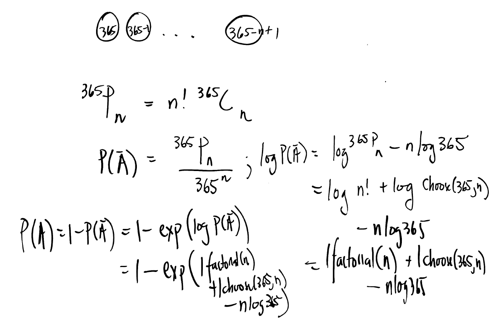

```{r, include = FALSE}
knitr::opts_chunk$set(
  collapse = TRUE,
  comment = "#>"
)
```

```{r setup}
library(MATH4753F25cale)
```

## Birthday function: background

We want to find $P(A)$, and the related to the probability of the complementary event by the formula:
$$P(A) = 1 - P(A^c)$$

### Calculating the Probability of the Complementary Event $P(A^c)$

To calculate $P(A^c)$, we will use permutations. We want to count the number of ways to assign $n$ unique birthdays to $n$ people and dividing it by the total number of possible birthday assignments.

### Total Number of Possible Outcomes:

For each person $n$, there are 365 possible birthdays. Since the choices are independent for each person, the total number of possible birthday combinations for a group of $n$ people is:

$$365 \times 365 \times ... \times 365 (n\  times) = 365^n$$

### Number of Favorable Outcomes (all birthdays are different):

These are the ways to choose $n$ distinct birthdays from 365 days and assign them to the $n$ people.

- The first person can have a birthday on any of the 365 days.
- The second person must have a different birthday, so there are 364 remaining days.
- The third person must have a different birthday from the first two, so there are 363 remaining days.
- This continues until the $n^th$ person, who has $365 - (n - 1)$ remaining choices.

So, the number of ways to assign $n$ unique birthdays is the product of these choices, which is a permutation:

$$365 \times 364 \times 363 \times ... \times (365 - n + 1) = P(365, n)$$

We can express this using factorials:

$$P(365,n) = \frac{365!}{(365-n)!}$$

Therefore, the probability that all $n$ people have different birthdays is the ratio of the number of favorable outcomes to the total number of outcomes: 

$$P(A^c) = \frac{365 \times 364 \times 363 \times ... \times (365 - n + 1)}{365^n}$$

We could also represent this as part of permutations:

$$P(A^c) = \frac{P(365,n)}{365^n} = \frac{365!}{(365-n)! \cdot 365^n}$$

### The Final Derivation

Finally, if we want to apply the probability for our original event, $P(A)$ we just need to apply the complement:

$$P(A) = 1 - P(A^c) = 1 - \frac{365 \times 364 \times 363 \times \cdot \cdot \cdot \times (365 - n + 1)}{365^n}$$

This can also be represented as:

$$P(A) = 1 - \frac{365!}{(365 - n)! \cdot 365^n}$$

This formula gives the probability of at least two people sharing a birthday in a group of size $n$. It yields a very high probability, which is counter-intuitive.

### Reformulation of problem using lchoose and lfactorial

<center>
{width="70%"}
</center

### Running the Birthday Function:

birthday(n = 20:25) ->

```{r, include=TRUE}
birthday(n = 20:25) 
```
